# **The instructions below are meant to work with Windows systems**

# Section 1: Set up QGIS

**Follow the steps in this section if QGIS is not installed on your computer**

1. Visit [QGIS Download Page](https://ftp.osuosl.org/pub/osgeo/download/qgis/windows) and download **QGIS-OSGeo4W-3.40.13-1.msi** for Windows. **Direct Link** [QGIS Direct Download Link](https://ftp.osuosl.org/pub/osgeo/download/qgis/windows/QGIS-OSGeo4W-3.40.13-1.msi) 

2. After Downloading the QGIS installer double click on the download to begin setup. Your computer may warn you about executing
a package from the internet, ignore this message as QGIS is a trusted developer.

3. Accept the terms in the license agreement.

4. Install QGIS to the default location, on my system it is **C:\Program Files\QGIS 3.40.11\\** and check the **Create Desktop**
shortcuts box. 

5. Finally click **install** (This process may take a couple of minutes)

---

# Section 2: Run the pts-shape-distances.py

1. Move project files onto your machine's file system 

   a. Copy the provided project folder onto your local machine. On my machine I copied them onto the Desktop to make finding the folder simple.

2. Python files

   a. **pts-shape-distances.py** is the python program that contains all of the logic to convert our input data into a report.

   b. **query.py** is an helper python program that communicates with the QGIS application to query the **Error** point layer and sanitize those points from the input csv file. 

3. Input files 

   a. **shortest-dist-gis-map.qgz** is a QGIS project file that contains the map configuration required for QGIS to know how our points and layers should be displayed onto the map. 

   b. **input/sample_path_data.csv** is an example input file expected by our python program. Your input file will need to have matching column values as presented in **input/sample_path_data.csv**. At this point it is recommended to move your input csv file into the input folder to make selecting it later easy. 

4. Output files

   The output files for your data file will not be present until **after** we run the python program.

   a. **InspectionReport_points.csv** is a file that contains a collection of all the points from our **path_data.csv**. This file will collect erroneous points that are either too close to an intersection or too far from any road data. 

   b. **InspectionReport.csv/excel** files contain a comprehensive report of all good points from our **path_data.csv**. This report will ignore any points that are calculated to be too far from a street. This can be due to an error in the point's gps data resulting in the point being in a location that is considered too far from a street. This case can also occur if our street layer lacks data on the particular street being surveyed. 

5. Executing pts-shape-distances.py

   a. Before continuing we first want to run **install_python.winget** by double clicking on it. This will open a console window that will display the file contents and then ask for permission to continue, in the console type "Y" and then press enter. This will allow the YAML script to install python and the required libraries. Once completed press enter on the console window to close the YAML script.

   b. Now we can run our python script so that our data files are created before we try to render the data. We must do this once before attempting to render the map layer otherwise QGIS will present us with a **Handle Unavailable Layers** error.

   c. First we want to copy the system path to our project files. For example the path on my system is **C:\Users\ciren\Desktop\CP2\shortest-dist-gis-map**. To make finding the path easy open up the **File Explorer** visit the location of the project files. At the top of the file explorer there is a box with the path of the current folder. Double clicking this box will allow us to copy the path to our project. Below is a screenshot example of where the path is.

   d. With the path to our project copied we now want to open a **Command Prompt** by searching **Command Prompt** in the Windows search bar. 

   e. Inside of the Command Prompt window we want to type the command **"cd {PASTE PATH HERE}"** Where {PASTE PATH HERE} is replaced by the path we copied in step a. This command will allow us to move into the folder with our project files. 

   f. We can now run the python program to create the output needed for QGIS to display on the map. To run the program type **"python pts-shape-distances.py"** in the command prompt we opened in the previous steps and press enter. Below is a screenshot of these commands being run on my system.

   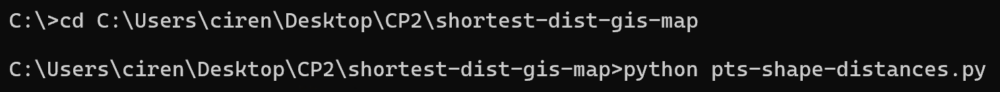

   g. After a few moments a python graphical user interface will appear, below is a screenshot of this gui. 

   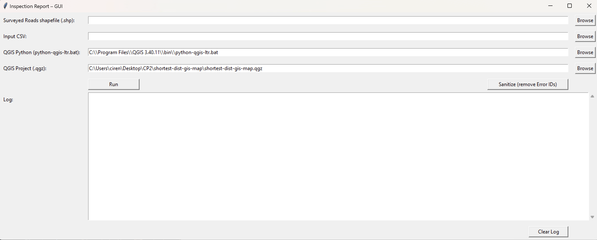

   h. Within the interface we will want to **Browse** and select your **Surveyed Roads shapefile (.shp)**  and the **Input CSV**. We also want to ensure that the **QGIS Python** and **QGIS Project** point to the correct files for your system. If you installed the same QGIS version to your C drive then the provided path for **QGIS Python (python-qgis-ltr.bat)** should be correct. **QGIS Project** will need to point to the QGIS map configuration file **shortest-dist-gis-map.qgz** located at the root of the project. 
   
   Once the files are selected click the **Run** button. Depending on the size of your input this process may take a few seconds to a minute or two. Wait for the program to prompt you with a successful output before continuing.  

   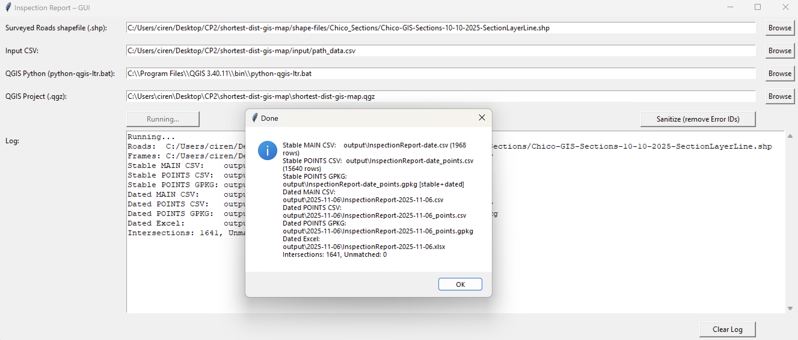

6. Open QGIS

   a. Open up QGIS either from the Desktop icon or by searching for QGIS in the Windows search bar.

   b. Open a new project **(Ctrl-O)** and select **shortest-dist-gis-map.qgz** This will open the premade project inside of QGIS. 

   c. Once the project is open if your data's shape file is not loaded then we will want to drag and drop your provided shape files. This file can be identified by its extension type **.shp**, in the file explorer the extension type can be found under the **type** column.

   d. Now QGIS will display a map with our report layer presented as **InspectionReport_points**. 

   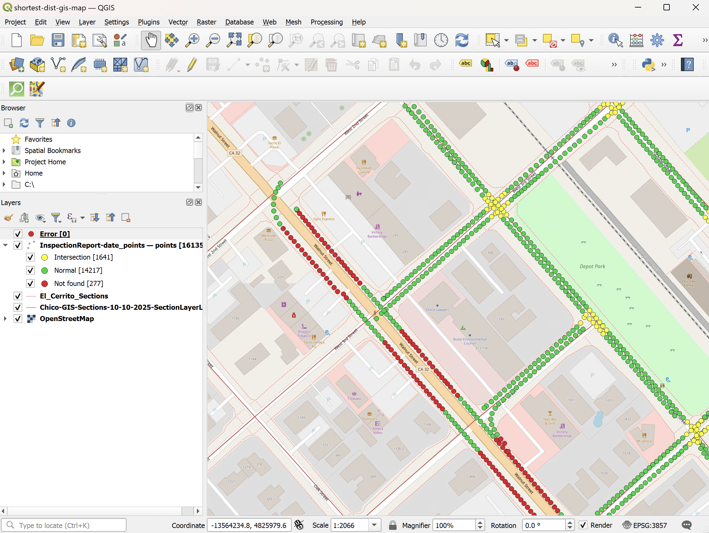

7. Sanitize the data

   Our next steps will provide instruction on how to move erroneous points to the **Error** layer. This layer will eventually be queried to remove these erroneous points from the input data. 

   a. First we want to select the main point layer **InspectionReport_points**. 

   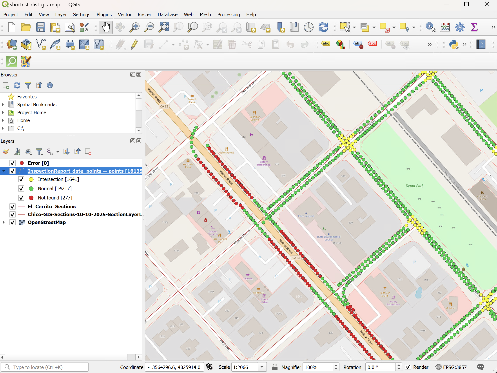

   b. Once our main layer is selected we then want to enable editing by clicking on the single pencil icon in the QGIS tool bar. See screenshot below. 

   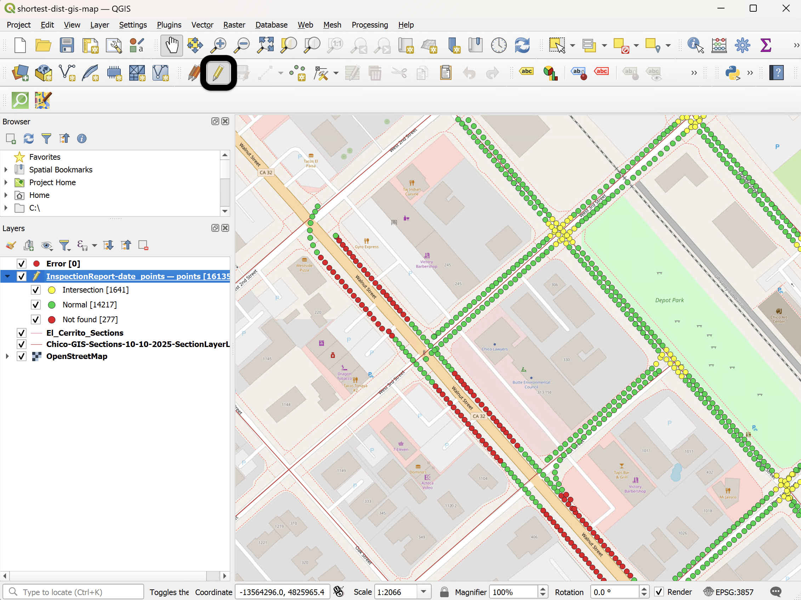

   c. Once editing is activated for this layer we can now use the select tool to pick out the erroneous points. When selecting the points, accuracy is of the utmost importance. 

   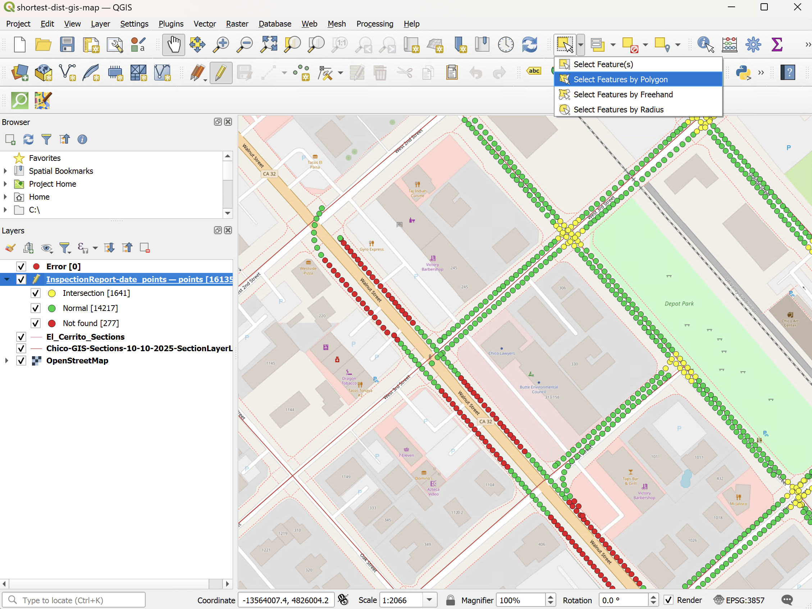

   d. Once you select the points you believe are erroneous right click on the map to select the points. 

   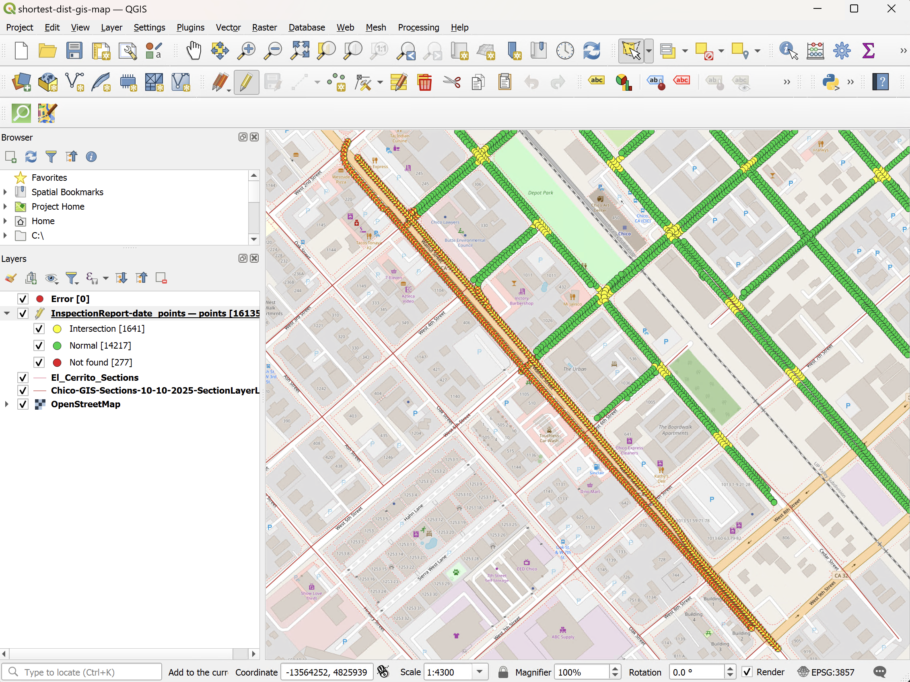

   e. Now with the points selected we want to copy them with the **"Copy features"** button in the QGIS tool bar.

   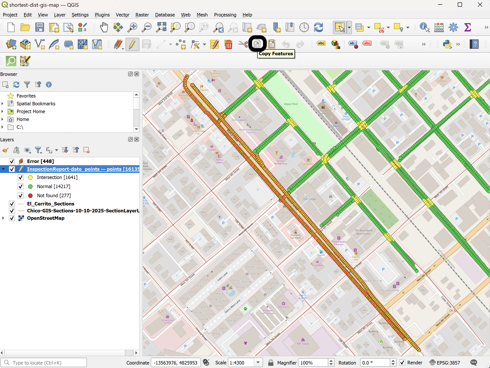 

   f. Now we want to switch to the **Error** layer by selecting it in the layer menu and then right clicking the layer to display more options. Within these options select **"Open Attribute Table"**. 

  

  g. Inside of the attribute table we first want to ensure the layer is editable so that we can paste the previous data. To enable editing in this layer select the pencil icon in the top left corner. 

   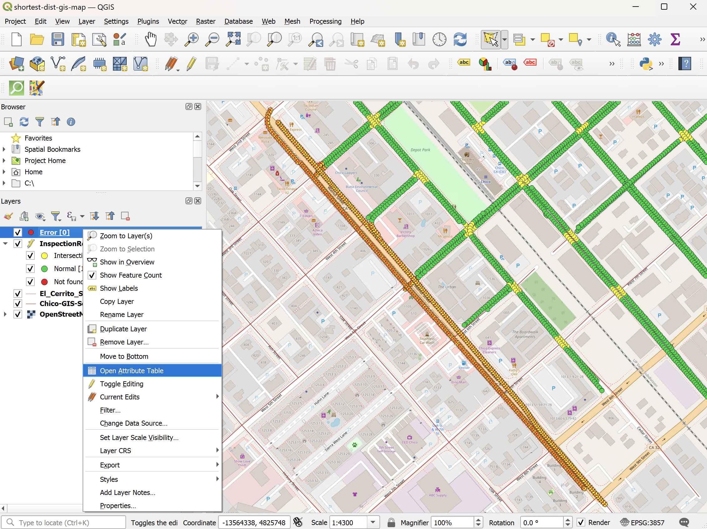

   h. With editing enabled we can now paste the previously copied data into the **Error** later. 
   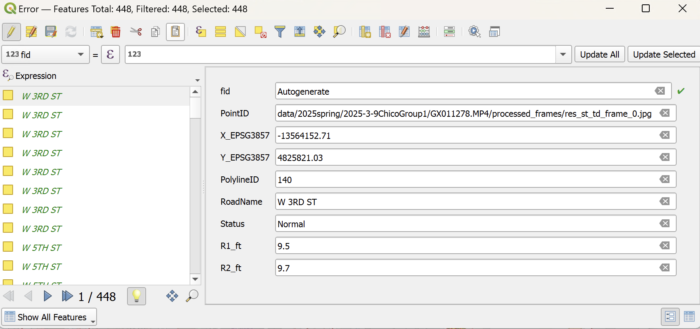

   i. Continue to copy/past additional points into the **Error** layer until you have categorized all the error points. 

   j. Now we can head back to the **pts-shape-distances.py** program. Within the GUI click on the **"Sanitize"** button. Wait a few moments for the program to scan the **Error** layer and sanitize the input of those erroneous points. 

   k. Before the map data is fixed we need to click on the run button within the GUI and once the program completes we can check the map to ensure those erroneous points are removed. 

   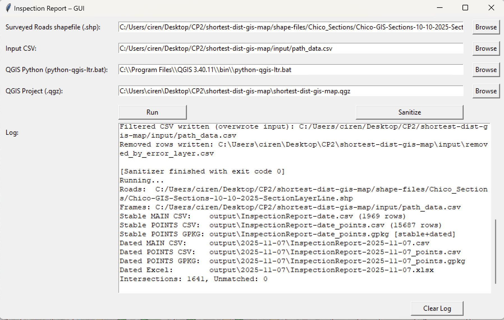

8. View data in QGIS

   a. Open Qgis and deselect the **Error** layer.
   
   b. We also want to refresh QGIS in case the program has old data.

   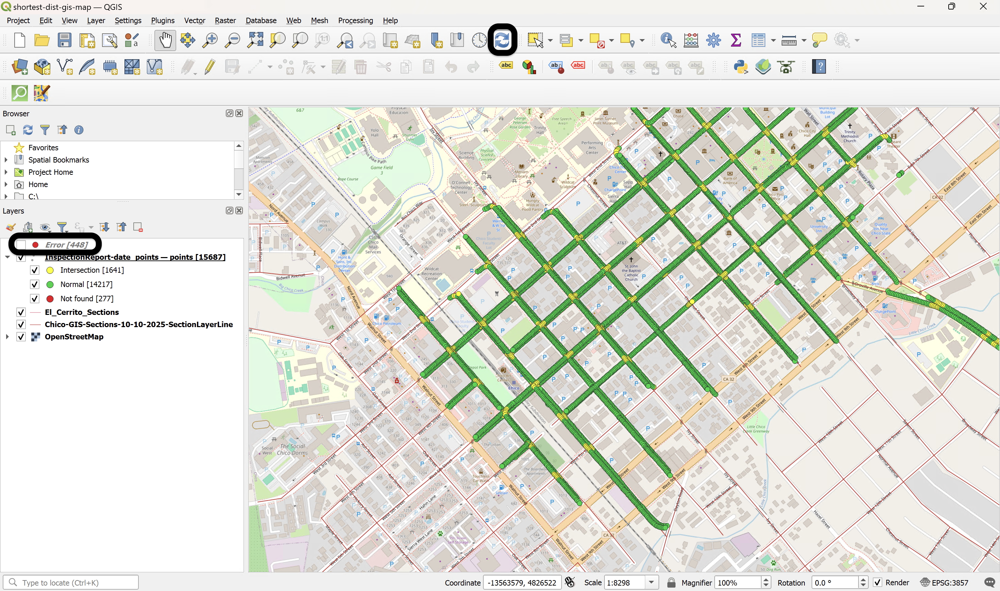

   c. We should now see all the points that were attached to our **Error** layer removed from the main **InspectionReport_points** layer. 
   